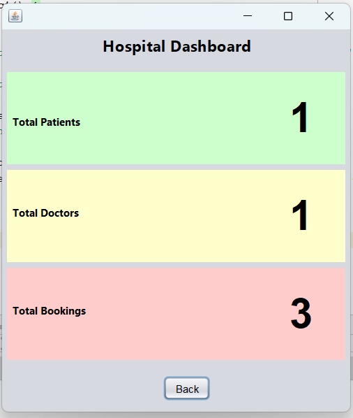
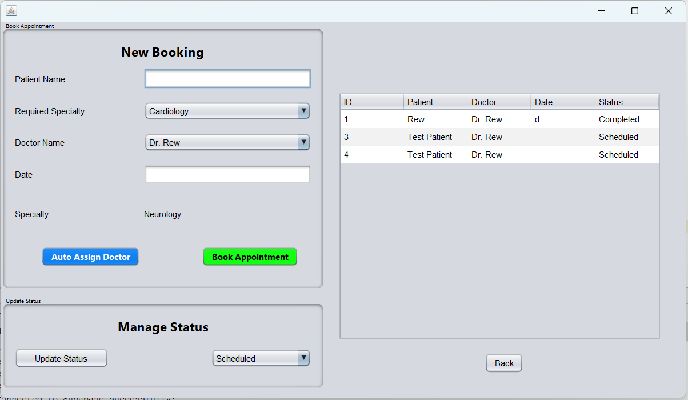
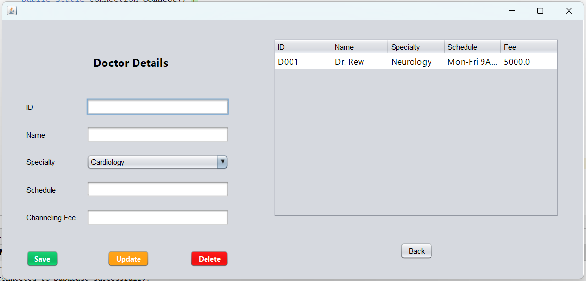

# MediCare Plus - Hospital Management System

A comprehensive, full-stack Java Swing application designed to streamline hospital operations. This system replaces manual booking processes with an automated, cloud-integrated solution.

## 🚀 Key Features
* **Smart Allocation:** Auto-assigns doctors to patients based on specialty.
* **Cloud Integration:** Connected to **Supabase (PostgreSQL)** for real-time remote data storage.
* **Live Dashboard:** Tracks patient volume, doctor availability, and income.
* **Status Tracking:** Manages the full appointment lifecycle (Scheduled → Completed).
* **Notifications:** System alerts for doctors and patients.

## 🛠 Technology Stack
* **Language:** Java (JDK 22)
* **GUI:** Java Swing (Custom UX Design)
* **Database:** Supabase (PostgreSQL)
* **IDE:** Apache NetBeans

## 📸 Screenshots

### 1. The Main Dashboard
Real-time analytics showing total patients, doctors, and active bookings.

### 2. Appointment Booking System
Complex form handling with automated doctor assignment and status tracking.

### 3. Doctor Management
Clean interface for managing doctor schedules and channeling fees.

---
*Created by Rewatha Sumanarathne - 2025*
